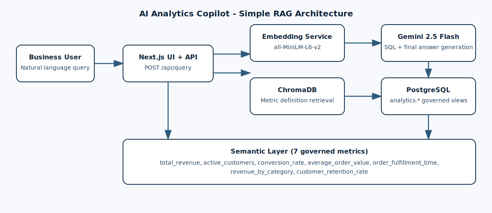
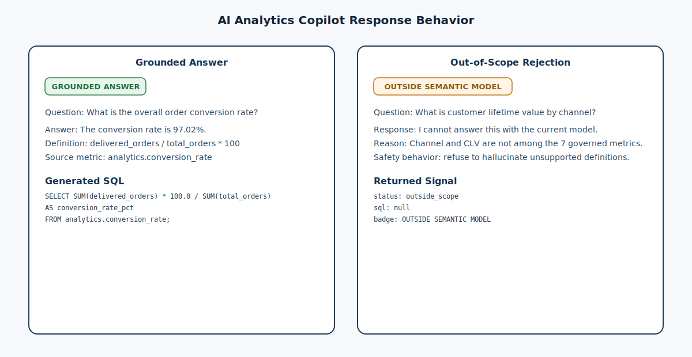

# scripts/

Python scripts that form the data and embedding pipeline for the AI Analytics Copilot. Run these once to set up the warehouse and the semantic layer before starting the Next.js app.

## Project Problem Statement

Business users cannot self-serve analytics because traditional BI workflows expect SQL proficiency, while unconstrained LLM assistants often hallucinate metric definitions and produce confident but ungrounded answers; these scripts operationalize the governed semantic layer that keeps answers tied to approved metric logic.

## Architecture Diagram



## Grounded vs Out-of-Scope Behavior



## Actual RAGAS Scores (Project-Level)

From `../ragas_results.json`:

| Metric | Score |
|---|---:|
| `faithfulness` | `0.15925925925925927` |
| `answer_relevancy` | `0.7108017722304754` |
| `context_precision` | `0.249999999975` |

## The 7 Defined Metrics (Business Definitions)

| Metric | Business definition |
|---|---|
| `total_revenue` | Total `payment_value` from delivered orders only; excludes cancelled, unavailable, and in-transit orders. |
| `active_customers` | Distinct `customer_unique_id` with at least one delivered order, preventing double counting from address-level customer IDs. |
| `conversion_rate` | Percentage of created orders that reach `delivered` status: `delivered_orders / total_orders * 100`. |
| `average_order_value` | Average revenue per delivered order (`AOV`) based on delivered-order payment values. |
| `order_fulfillment_time` | Average calendar days from purchase timestamp to customer delivery timestamp for delivered orders. |
| `revenue_by_category` | Delivered revenue segmented by `product_category_name`; used for category performance questions. |
| `customer_retention_rate` | Monthly cohort retention: percentage of month-N buyers who purchase again in month N+1. |

---

## Scripts overview

### `load_data.py` — ETL pipeline

Reads the Olist CSV files, loads them into PostgreSQL, and builds nine analytics views from the SQL model files.

**Run:**
```bash
python scripts/load_data.py
```

**What it does, in order:**

| Phase | Action |
|---|---|
| 0 — Cleanup | Drops all existing analytics views to avoid dependency conflicts on re-runs |
| 1 — Raw load | Reads each CSV from `data/` into a table in the `raw` schema using pandas + SQLAlchemy |
| 2 — Views | Executes every SQL file under `models/intermediate/` and `models/metrics/` to create views in the `analytics` schema |

**Raw tables created (`raw` schema):**

- `raw_orders`
- `raw_order_items`
- `raw_customers`
- `raw_products`
- `raw_payments`
- `raw_sellers`
- `raw_order_reviews`
- `raw_geolocation`

**Analytics views created (`analytics` schema):**

*Intermediate (helpers used by metrics):*
- `products` — cleaned product catalogue with translated category names
- `sellers` — seller dimension with state/city

*Metrics (the governed semantic layer):*
- `total_revenue`
- `active_customers`
- `conversion_rate`
- `average_order_value`
- `order_fulfillment_time`
- `revenue_by_category`
- `customer_retention_rate`

**Configuration** — reads from environment variables (via `.env` in the project root):

| Variable | Default | Description |
|---|---|---|
| `POSTGRES_USER` | `analytics` | Database username |
| `POSTGRES_PASSWORD` | `analytics` | Database password |
| `POSTGRES_HOST` | `127.0.0.1` | Host |
| `POSTGRES_PORT` | `5433` | Port (mapped from Docker) |
| `POSTGRES_DB` | `olist` | Database name |

---

### `embed_semantic_layer.py` — Semantic layer ingestion

Vectorises the seven metric definitions and upserts them into the ChromaDB `semantic_layer` collection. This is what enables the RAG-based retrieval in the Next.js API route.

**Run:**
```bash
python scripts/embed_semantic_layer.py
```

**What it does:**

1. Connects to ChromaDB at `127.0.0.1:9000` (Docker host port).
2. Drops and recreates the `semantic_layer` collection with cosine similarity.
3. For each of the seven metrics, generates a rich text document containing its definition, SQL view name, available dimensions, and natural-language synonyms.
4. Encodes those documents using `all-MiniLM-L6-v2` via `sentence-transformers`.
5. Caches the resulting embeddings to `.embedding_cache.json` (keyed by a SHA-256 hash of the texts) so subsequent runs skip the model load if nothing changed.
6. Upserts the documents and their pre-computed vectors into ChromaDB.

**Metric documents embedded:**

| ID | Used for |
|---|---|
| `total_revenue` | Revenue, sales, earnings, income queries |
| `active_customers` | Customer count, user base queries |
| `conversion_rate` | Funnel, order success rate queries |
| `average_order_value` | AOV, basket size, average purchase queries |
| `order_fulfillment_time` | Delivery speed, logistics, shipping time queries |
| `revenue_by_category` | Product category performance queries |
| `customer_retention_rate` | Retention, churn, repeat buyer queries |

> **Important:** This script must use the same embedding model as `embedding_service.py`. If you change the model in one place, change it in both, and re-run this script to rebuild the ChromaDB collection.

---

### `embedding_service.py` — Embedding microservice

A lightweight FastAPI service that exposes a `/embed` endpoint. The Next.js API route calls this at query time to embed user questions, ensuring the query vector is in the same space as the stored ChromaDB embeddings.

**Run locally:**
```bash
python scripts/embedding_service.py
# Listens on http://localhost:8001
```

In Docker, this is started automatically by `docker compose up`.

**Endpoints:**

| Method | Path | Description |
|---|---|---|
| `POST` | `/embed` | Accepts `{ "text": "..." }`, returns `{ "embedding": [...] }` |
| `GET` | `/health` | Returns `{ "status": "ok" }` |

**Model:** `sentence-transformers/all-MiniLM-L6-v2` — loaded once at startup, ~22 MB, CPU-only PyTorch build (~170 MB image vs ~1.5 GB for CUDA).

---

## Running order

If starting from scratch:

```bash
# 1. Start all Docker services
docker compose up -d

# 2. Load data and build views  (run from project root)
python scripts/load_data.py

# 3. Embed the semantic layer
python scripts/embed_semantic_layer.py

# 4. Start the Next.js dev server (optional — Docker already serves it on :3000)
cd olist-copilot && npm run dev
```

Steps 2 and 3 can be re-run any time to refresh the warehouse or update the semantic layer without restarting Docker.
